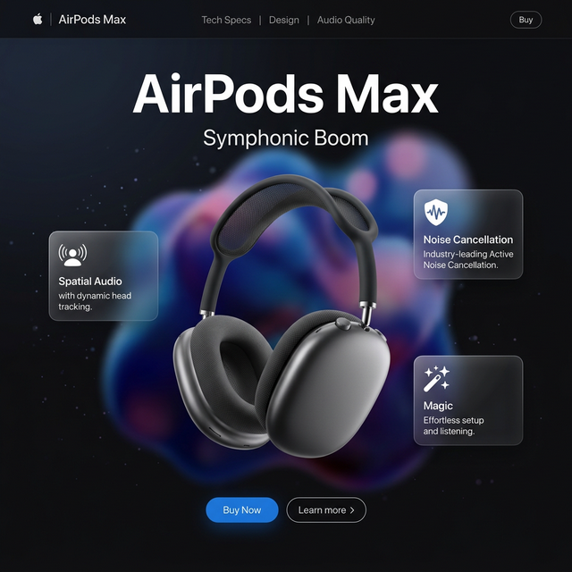

# 🎧 Product Store | Premium Apple Collection

[](https://vitejs.dev/)
[](https://reactjs.org/)
[](https://tailwindcss.com/)
[](https://www.framer.com/motion/)

> A premium, high-fidelity web experience inspired by Apple designers. Built with React, Framer Motion, and absolute precision.

---

## ✨ The Landing Page

Our flagship landing page is designed to wowed you at first glance. It features a stunning dark aesthetic, liquid fluid backgrounds, and interactive 3D-tilt product sections.



### Key Features of the Landing Page:
- **🌊 Morphing Background**: A custom SVG-based liquid fluid animation that evolves as you browse.
- **🎮 3D Tilt Interaction**: Products respond to your mouse movement with realistic spring-based 3D rotation.
- **💎 Glassmorphism**: High-end UI components using backdrop-blur and fine-tuned opacity for a premium feel.
- **🎬 Cinematic Animations**: Scroll-linked animations and smooth entry reveals powered by Framer Motion.
- **📱 Ultra Responsive**: Fluid layouts that adapt seamlessly from mobile to desktop.

---

## 🚀 Getting Started

To get this experience running on your local machine:

1. **Install Dependencies**
   ```bash
   npm install
   ```

2. **Run Development Server**
   ```bash
   npm run dev
   ```

3. **Build for Production**
   ```bash
   npm run build
   ```

---

## 🛠️ Technology Stack

| Tech | Description |
| :--- | :--- |
| **React** | Core UI Library |
| **Vite** | Lightning fast build tool |
| **Tailwind CSS** | Utility-first styling with custom Apple tokens |
| **Framer Motion** | Industry-leading animation engine |
| **Lucide React** | Beautiful, consistent iconography |

---

## 🎨 Design Philosophy

This project follows the **Apple Design Language**:
- **Minimalism**: Focusing on the product and essential information.
- **Typography**: Utilizing clean fonts with adjusted tracking and leading.
- **Interaction**: Subtle micro-interactions that make the interface feel alive.
- **Color**: A refined palette of Space Gray, Silver, and deep Apple Blue.

---

<p align="center">
  Built with ❤️ for the future of UI.
</p>
